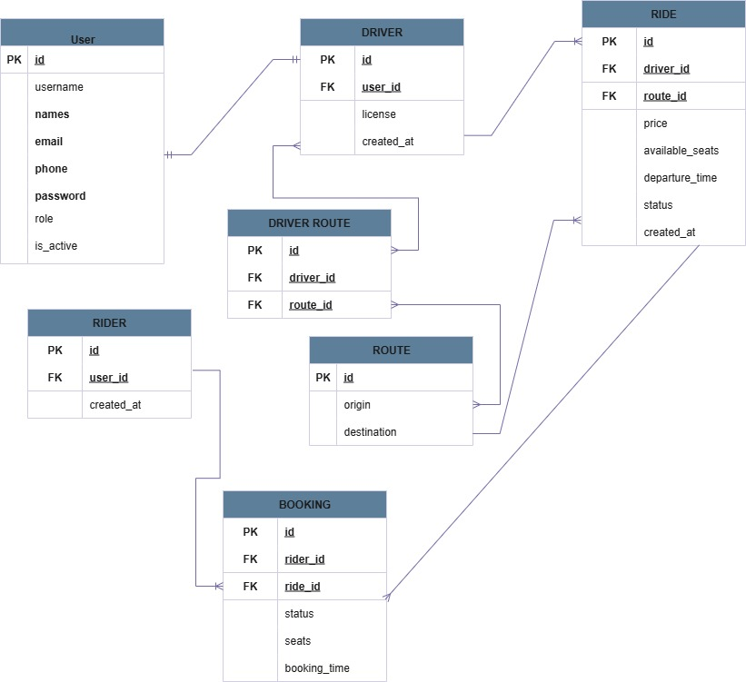

# Ride Sharing System - How It Works

##  Overview

This is a ride-sharing platform that connects **Riders** (passengers) with **Drivers** who offer rides along specific routes.

---

## Who Uses the System?

The system has three types of users:

### 1. **Riders** (Passengers)
- People who need transportation
- Can search for available rides
- Can book seats on rides
- Can view their booking history

### 2. **Drivers**
- People who offer transportation services
- Must have a valid driver's license
- Can create rides on specific routes
- Can manage their rides and see who has booked

### 3. **Admins**
- System administrators
- Manage users and monitor the platform
- Handle disputes and issues

---

##  How the System Works

### Step 1: User Registration & Profiles

**Everyone starts by creating an account:**
- Provide your name, email, and phone number
- Choose your role (Rider or Driver)
- Set a secure password

**If you're a Driver:**
- After registering, you need to create a driver profile
- Provide your driver's license number
- Select which routes you want to operate on

**If you're a Rider:**
- After registering, a rider profile is automatically created
- You're ready to start booking rides

---

### Step 2: Routes

**What is a Route?**
A route is a path from one location to another. For example:
- Kigali → Huye
- Musanze → Kigali
- Rubavu → Gisenyi

**How Routes Work:**
- Routes are predefined in the system
- Drivers choose which routes they want to operate on
- One driver can operate on multiple routes
- Multiple drivers can operate on the same route

---

### Step 3: Creating Rides (For Drivers)

**When a driver wants to offer a ride:**

1. **Select a Route**: Choose from your approved routes (e.g., Kigali → Huye)
2. **Set the Price**: How much will each seat cost? (e.g., 3,000 RWF)
3. **Set Departure Time**: When will you leave? (e.g., Tomorrow at 8:00 AM)
4. **Set Available Seats**: How many passengers can you take? (e.g., 4 seats)

**Example:**
```
Driver: John Doe
Route: Kigali → Huye
Price: 3,000 RWF per seat
Departure: Dec 15, 2024 at 8:00 AM
Available Seats: 4
Status: Scheduled
```

---

### Step 4: Booking Rides (For Riders)

**When a rider wants to book a ride:**

1. **Search for Rides**: Look for rides going to your destination
   - Filter by route, date, and price
   - See available seats

2. **Select a Ride**: Choose a ride that fits your schedule

3. **Book Seats**: 
   - Select how many seats you need (1, 2, or more)
   - Confirm your booking

4. **Booking Status**:
   - **Pending**: Waiting for driver confirmation
   - **Confirmed**: Your seat is secured
   - **Completed**: The ride has finished
   - **Cancelled**: Booking was cancelled

**Example:**
```
Rider: Jane Smith
Ride: Kigali → Huye (Driver: John Doe)
Seats Booked: 2
Price: 6,000 RWF (2 seats × 3,000 RWF)
Status: Confirmed
```

---

## System Flow Diagram

```
┌─────────────┐
│    USER     │
│ (Register)  │
└──────┬──────┘
       │
       ├─────────────┬─────────────┐
       ▼             ▼             ▼
   ┌───────┐    ┌────────┐    ┌───────┐
   │ RIDER │    │ DRIVER │    │ ADMIN │
   └───┬───┘    └────┬───┘    └───────┘
       │             │
       │             ├─→ Select Routes
       │             │
       │             ├─→ Create RIDE
       │             │   (Route, Price,
       │             │    Time, Seats)
       │             │
       ▼             ▼
   Search Rides ←── RIDE ──→ Manage Ride
       │             │
       ├─→ Select    │
       │   Ride      │
       │             │
       ├─→ BOOKING ←─┤
       │   (Confirm  │
       │    Seats)   │
       │             │
       ▼             ▼
   View Bookings  View Passengers
```

---

## ERD DIAGRAM 




## Important Features

### For Riders:
-  Search rides by route and date
-  Book multiple seats in one booking
-  View all your bookings (past and upcoming)
-  Cancel bookings if plans change
-  See driver information

### For Drivers:
-  Create multiple rides on your routes
-  Set your own prices
-  See who has booked your rides
-  Manage seat availability
-  Cancel rides if needed
-  View your ride history

### For Everyone:
-  Secure login with email and password
-  Contact information (phone) for communication
-  Timestamp tracking (when bookings/rides were created)
-  Status tracking for rides and bookings

---

##  Data We Track

### User Information:
- Name, email, phone number
- Role (Rider/Driver/Admin)
- Account status (Active/Inactive)

### Driver Information:
- License number
- Routes they operate on
- All their rides

### Ride Information:
- Which driver is offering it
- Which route it follows
- Price per seat
- Number of available seats
- Departure date and time
- Current status

### Booking Information:
- Which rider made the booking
- Which ride they booked
- How many seats they booked
- Booking status
- When the booking was made

---

##  Benefits

### For Riders:
-  Affordable transportation
-  Flexible scheduling
-  Easy to find rides
-  Know your driver in advance

### For Drivers:
-  Earn money from your trips
-  Control your schedule
-  Make use of empty seats
-  Know your passengers

### For the Platform:
-  Reduce traffic congestion
-  Environmentally friendly (carpooling)
- Build community connections
- Track and improve service

---

##  Booking Lifecycle

```
Ride Created (Driver)
       ↓
Ride Available for Booking
       ↓
Rider Searches & Finds Ride
       ↓
Rider Makes Booking → Status: PENDING
       ↓
Driver Reviews Booking
       ↓
Driver Confirms → Status: CONFIRMED
       ↓
Departure Time Arrives
       ↓
Ride Happens
       ↓
Ride Completed → Status: COMPLETED
       ↓
Booking Marked Complete
```

---

##  Safety & Trust

- All drivers must provide valid license numbers
- Contact information is verified (email and phone)
- Booking history helps build trust
- Status tracking ensures transparency
- Admin oversight for dispute resolution

---


**This system makes transportation easier, more affordable, and more efficient for everyone!**